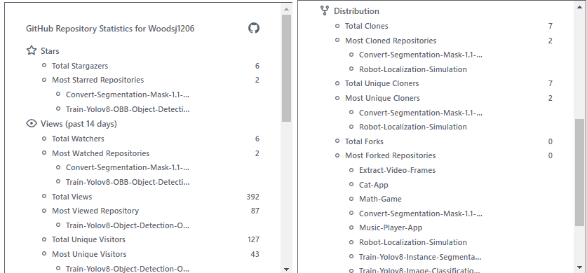
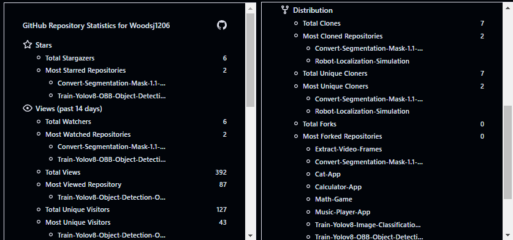
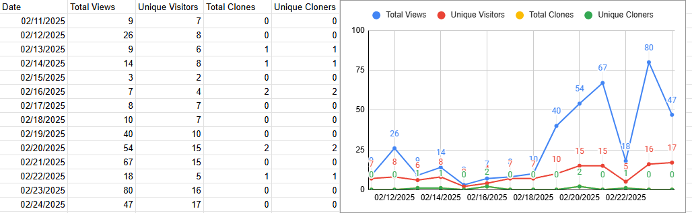

# GitHub-Repository-Statistics
This program uses the [GitHub API](https://docs.github.com/en/rest) to track stars, forks, watchers, clones, and traffic trends across a user's public repositories. It generates CSV reports and an HTML summary card with the key statistics.


## Overview
The following table highlights the different output formats that the program generates. It provides examples of the HTML reports in both light and dark themes, as well as a sample of how the generated CSV report can be imported into Google Sheets for further analysis and visualization.

| Feature                                                      | Preview                                                                                                                                                                                                                                                                                           |
| ------------------------------------------------------------- | ------------------------------------------------------------------------------------------------------------------------------------------------------------------------------------------------------------------------------------------------------------------------------------------------------ |
| Light Theme HTML Report	                                                    | This is the HTML output generated using the light theme. <br/><br/>   |
| Dark Theme HTML Report	          |  This is the HTML output generated using the dark theme. <br/><br/>                                 |
| Google Sheets Report Sample	      |   Example of the `total_traffic_metric_report.csv` imported into Google Sheets for further analysis and chart creation. <br/><br/> 

                                
## Usage
Follow these steps to set up and run the program:

### 1. Clone the Repository
Download the repository and navigate to its directory:
```bash
git clone https://github.com/woodsj1206/GitHub-Repository-Statistics.git
cd GitHub-Repository-Statistics
```

### 2. Create and Activate a Virtual Environment
Set up a virtual environment to manage dependencies:
```bash
python -m venv venv
venv/Scripts/activate
```

### 3. Install Dependencies
Install the required Python packages:
```bash
pip install -r requirements.txt
```

### 4. Configure Environment Variables
Create a `.env` file in the project root and add your GitHub credentials:
```ini
nano .env
GITHUB_USERNAME="your_github_username"
PERSONAL_ACCESS_TOKEN="your_github_token"
```
> [!IMPORTANT]
> If you do not have a [Personal Access Token](https://github.com/settings/personal-access-tokens), generate one and ensure it has read-only permissions for your repositories.

### 5. Run the Main Script
Execute the main script to generate reports:
```bash
python main.py
```

### 6. Access the Generated Reports
After running the script, the following files will be generated in `output_files`:
- `index.html` 
- `repository_metrics_report.csv`
- `total_traffic_metric_report.csv`
- `traffic_metric_timestamp_report_clones_count.csv`
- `traffic_metric_timestamp_report_clones_uniques.csv`
- `traffic_metric_timestamp_report_views_count.csv`
- `traffic_metric_timestamp_report_views_uniques.csv`


## Project Structure
The following shows the main file structure of the project with brief descriptions:
```
├── api_utils.py                # Functions for interacting with the GitHub API
├── csv_report_generator.py     # Generates CSV reports from fetched repository data
├── html_generator.py           # Creates interactive HTML summary reports
├── csv_handler.py              # Handles reading and writing CSV files
├── main.py                     # Main script to execute the data fetching and report generation
├── repository_metric.py        # Defines repository metric tracking classes and logic
├── user.py                     # Manages user-related data and GitHub credentials
├── requirements.txt            # Lists Python dependencies required for the project
└── .env                        # Environment variables for GitHub authentication      
```

## Acknowledgements
List of external resources used in the project, along with related projects:
### External Resources:
- This program uses [Octicons](https://github.com/primer/octicons) for the icons in the HTML summary card.
### Related Projects:
  - [github-readme-stats](https://github.com/anuraghazra/github-readme-stats) by [anuraghazra](https://github.com/anuraghazra)
  - [github-stats](https://github.com/jstrieb/github-stats) by [jstrieb](https://github.com/jstrieb)
## Development Environment
Tools and technologies used in the development of the project:
- IDE: Microsoft Visual Studio Community 2022 
- Language: Python 3.9
